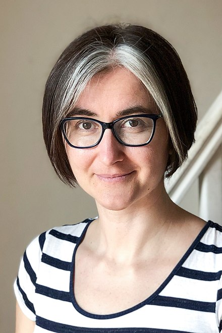
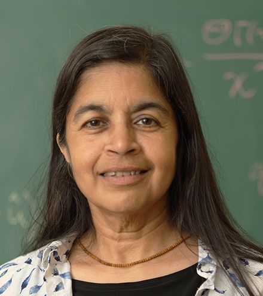
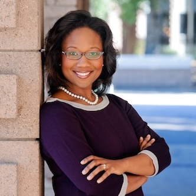
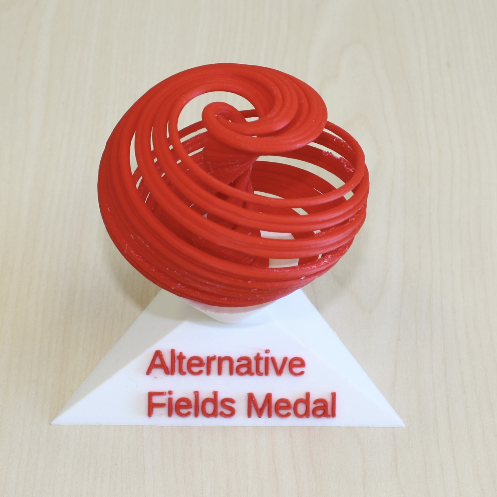
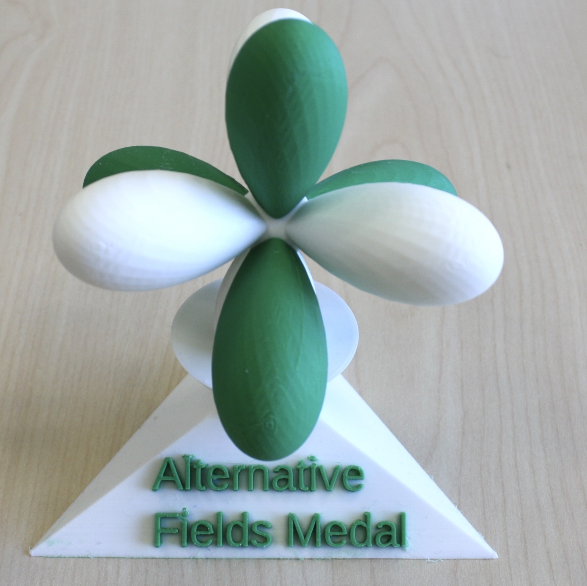
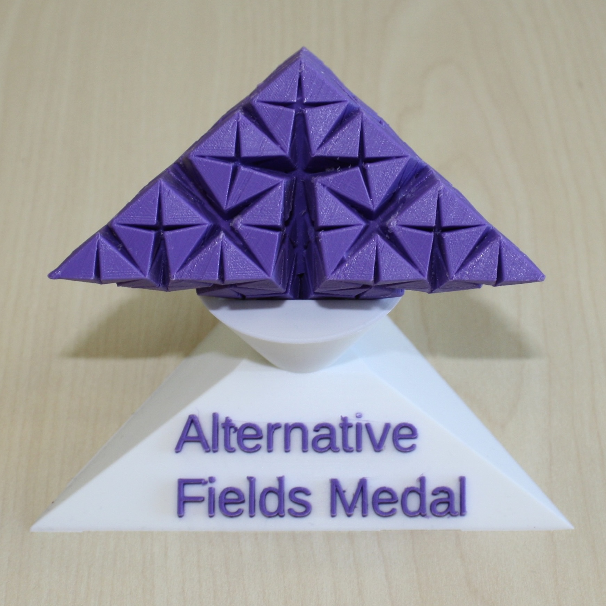
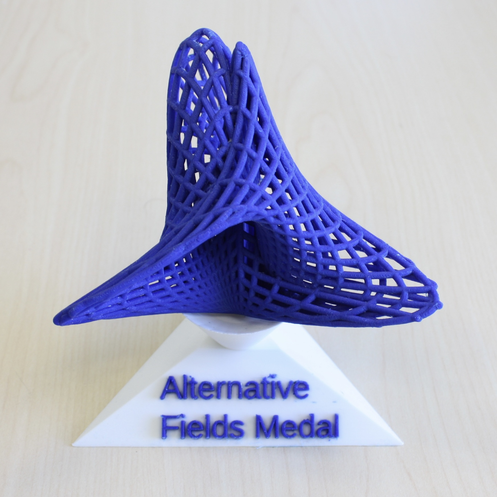

**About the award**

To help recognize the many important types of contributions to mathematics, we have created Alternative Fields Medals. These will be awarded in four different categories that complement what is recognized by the original Fields Medals. These categories (all of equal prestige) are as follows: 

1. Excellence in mathematics research by somebody who is currently over the age of 40.

2. Excellence in mathematics research with approaches that are not mathematically rigorous (construed broadly).

3. Excellence in leadership in the mathematics community (construed broadly).

4. Excellence in exposition of mathematics to a popular audience.

**2026 Awards**

- We are seeking **nominations** for the four categories! (We need your suggestions before **May 10**.)
- For more information, please contact Mason Porter and Evelyn Sander by direct message or e-mail.
- **Winners are announced below on May 25, 2026.**
- The award consists of a 3D-printed mathematical trophy and some bragging rights.
- The decision for who ultimately receives the award is made solely by Mason Porter and Evelyn Sander. We are speaking on our own behalves and are not representative of anyone else. Our authority is based solely on (1) coming up with the idea and (2) making the trophies.

**2022 Awards**

**Winners**

| {: width="100"} |{: width="100"}|{: width="100"} |{: width="100"}|

 [Andrew J. Bernoff](http://www.math.hmc.edu/~ajb/)
 Excellence in mathematics research by somebody who is currently over the age of 40:
 Excellence in mathematics research with approaches that are not mathematically rigorous (construed broadly):  
[Lenka Zdeborová - Wikipedia](https://en.wikipedia.org/wiki/Lenka_Zdeborov%C3%A1) |

 Excellence in leadership in the mathematics community (construed broadly): 
[Nalini Joshi](https://en.wikipedia.org/wiki/Nalini_Joshi) | 
 Excellence in exposition of mathematics to a popular audience: 
[Talithia Williams](https://en.wikipedia.org/wiki/Talithia_Williams)|

**Trophies 2022**

- The Langford Attractor

{: width="100"}

The dynamical system that has the Langford chaotic attractor is mentioned in this article "[Modeling Dynamical Systems for 3D Printing](https://ams.org/journals/notices/202011/rnoti-p1692.pdf)" by Stephen K. Lucas, Evelyn Sander, and Laura Taalman; in Notices of the AMS. 

- Spherical Harmonic

{: width="100"}

To learn more about spherical harmonics, see the Wikipedia page: [https://en.wikipedia.org/wiki/Spherical_harmonics](https://t.co/G9pyXDzcON)

- Iterated function system

{: width="100"}

Trophy based on “[Three-Dimensional Fractals](http://stubber.math-inf.uni-greifswald.de/~bandt/pub/bandtduymesing.pdf…)” by Bandt, Duy, and Mesing; in The Mathematical Intelligencer. To learn more about iterated function systems, see the Wikipedia page: https://en.wikipedia.org/wiki/Iterated_function_system

- Boys surface 

{: width="100"}

You can read more about Boy's Surface (which was named after Werner Boy, from work in his dissertation under David Hilbert) at this page: [https://virtualmathmuseum.org/Surface/boys_apery/boys_apery.html](https://t.co/KqnN1knkho)

Trophy Design: Evelyn Sander. 
Trophy Printing: Patrick Bishop. 
Photo credits: All photos by D.M. Anderson. 

- Thank you to those who contributed **nominations** for the four categories! (We received suggestions before **May 10**.)
- **Winners were announced on May 25, 2022.**

