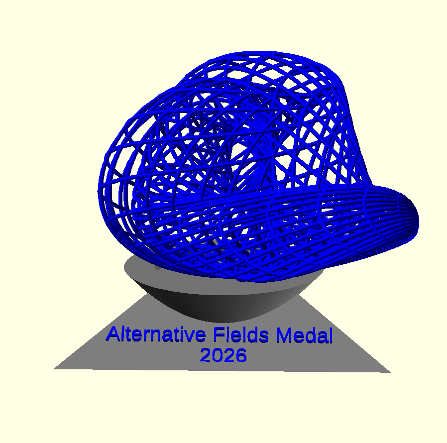
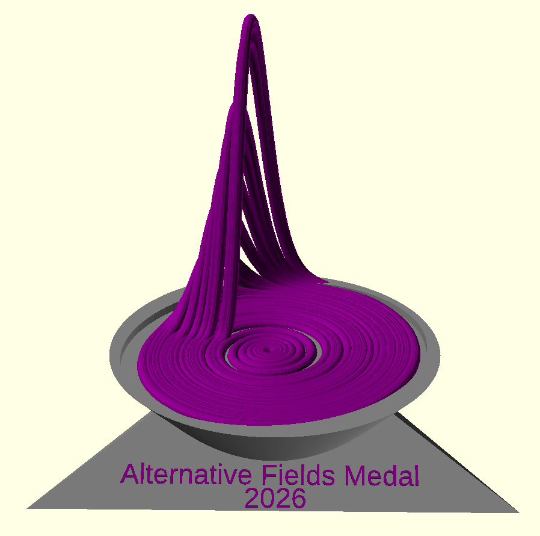
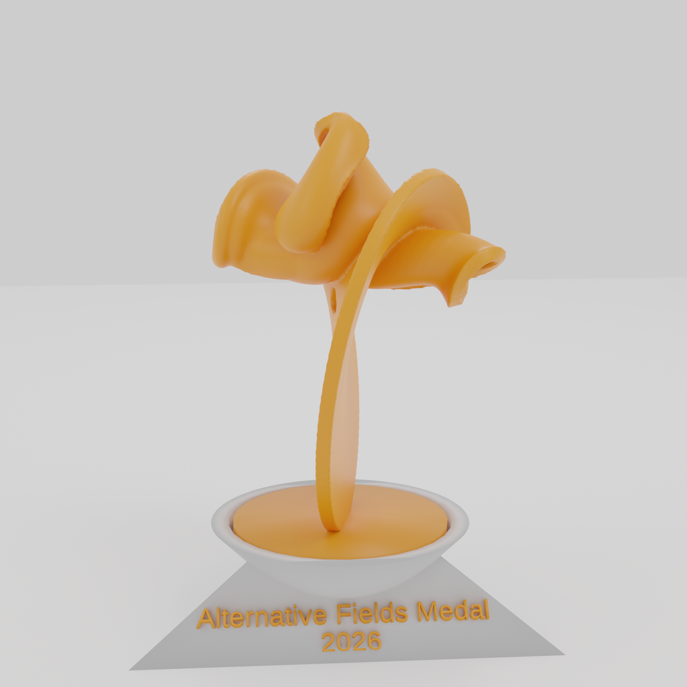
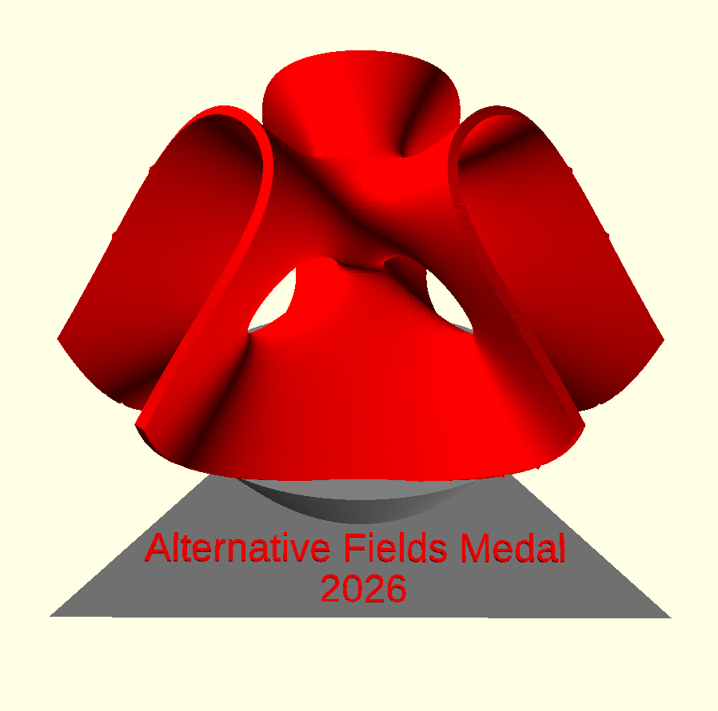
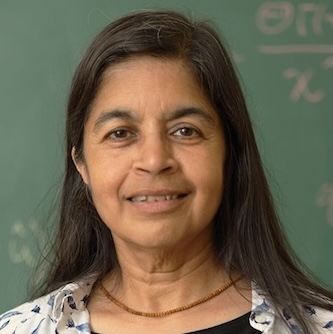
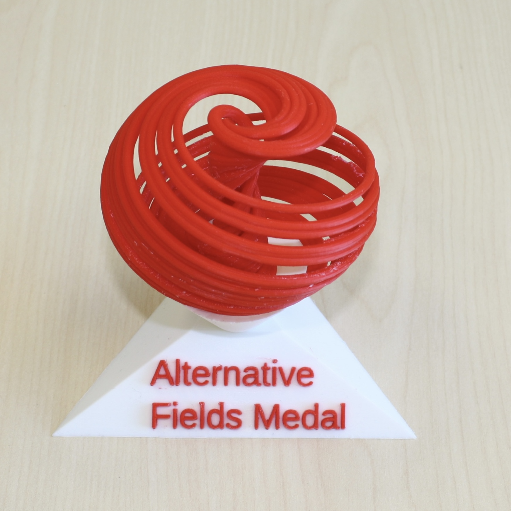
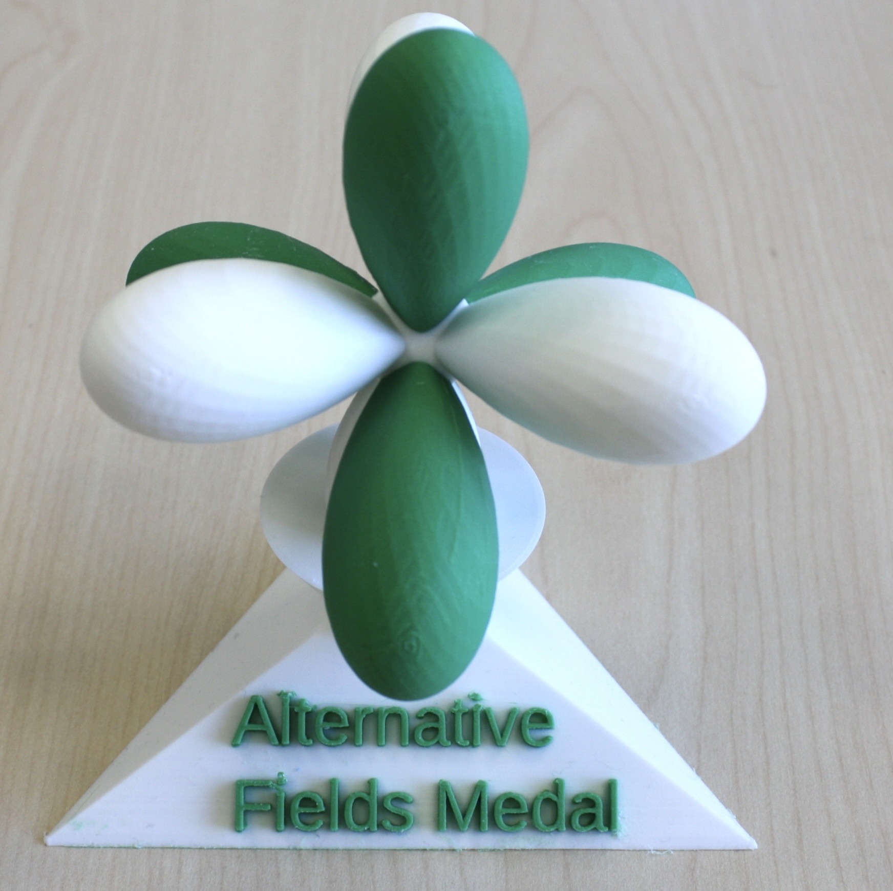
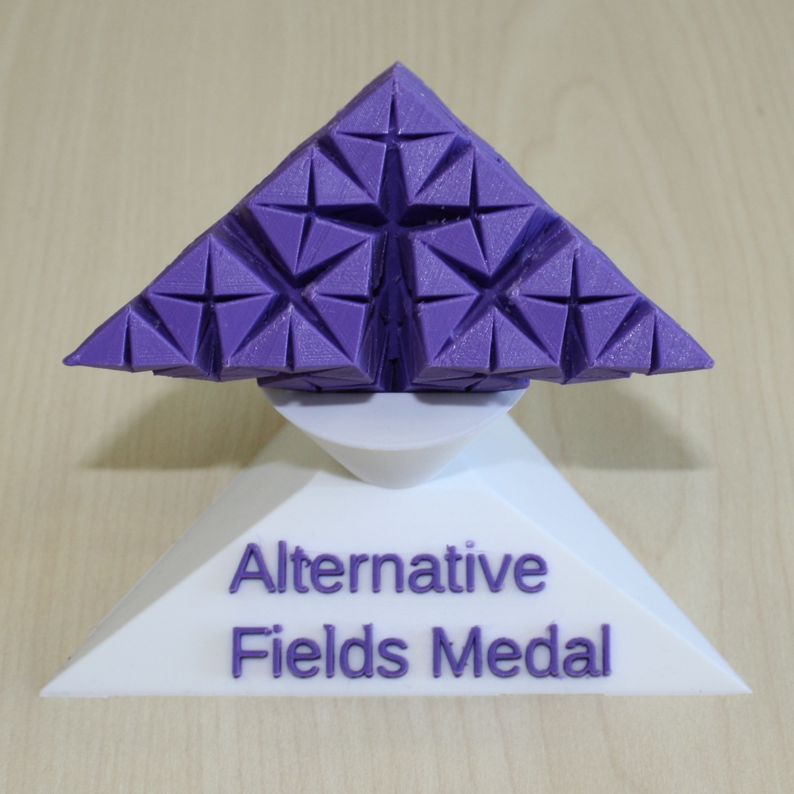
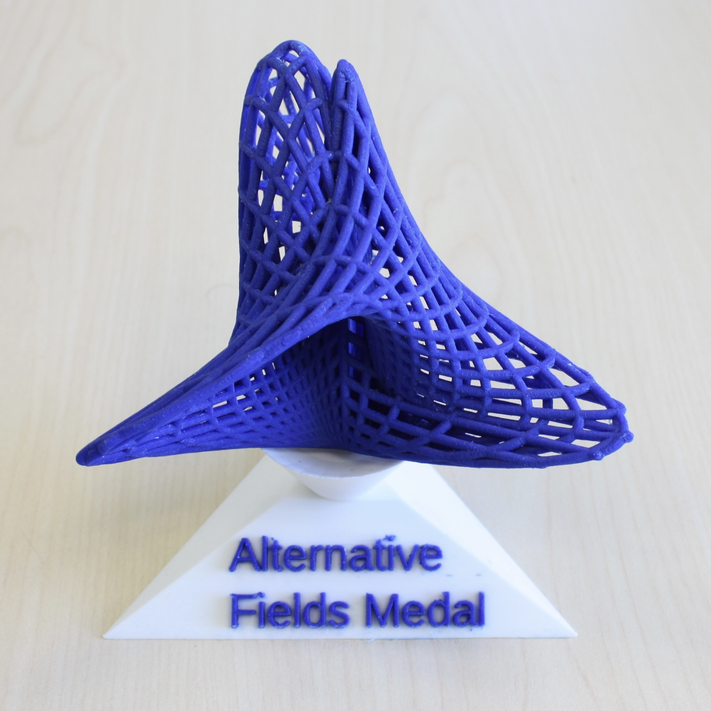

**About the award**

To help recognize the many important types of contributions to mathematics, we have created Alternative Fields Medals. These will be awarded in four different categories that complement what is recognized by the original Fields Medals. These categories (all of equal prestige) are as follows: 

1. Excellence in mathematics research by somebody who is currently over the age of 40.

2. Excellence in mathematics research with approaches that are not mathematically rigorous (construed broadly).

3. Excellence in leadership in the mathematics community (construed broadly).

4. Excellence in exposition of mathematics to a popular audience.

**2026 Awards**

- We will be announcing the winners soon! 
- Thank you for the  **nominations** for the four categories! The last date for suggestions was **July 10, 2026**
- All nominations should be sent to AFM.prize@gmail.com 
- **We will then determine the winners.**
- The award consists of a 3D-printed mathematical trophy and some bragging rights.
- The decision for who ultimately receives the award is made solely by Mason Porter and Evelyn Sander. We are speaking on our own behalves and are not representative of anyone else. Our authority is based solely on (1) coming up with the idea and (2) making the trophies.

**AFM Trophies 2026**

The following are mockups of the trophies. Photos will fill in as they get printed.

||
|
|
|
|Girl's Surface|Lorenz Manifold|Roessler Attractor|Clebsch Surface|

**The math behind the trophies**

- Girl’s Surface is a compact immersion of the real projective plane into three-dimensional space due to Goodman and Kossokowski in 2009. (The name is a tongue in cheek reference:  the best known compact immersion was developed in 1901 by Werner Boy, and is known as Boy’s Surface.) For more information, see [Girl’s surface](https://people.eecs.berkeley.edu/~sequin/PAPERS/2013_Bridges_GirlSurface.pdf) by Sue Goodman, Alex Mellnik, and Carlo Sequin; in Proceedings of Bridges, 2013. 

- The Lorenz system was original developed in 1963 as a simplified model of atmospheric convection. This object is the two-dimensional stable manifold of the equilibrium point at the origin. See 
 [3D Printing of Invariant Manifolds in Dynamical Systems](https://www.ams.org/journals/notices/202601/noti3288/noti3288.html), by 
Patrick R. Bishop, Summer Chenoweth, Emmanuel Fleurantin, Alonso Ogueda-Oliva, Evelyn Sander, and Julia Seay in the AMS Notices, 2026. 

- The Rössler system was originally created in 1976 in [An equation for continuous chaos](https://www.sciencedirect.com/science/article/abs/pii/0375960176901018), by O. E. Rössler, in Physics Letters, with the goal of showing that chaos could occur in systems that were even simpler than the Lorenz system.
 See also [Modeling Dynamical Systems for 3D Printing](https://www.ams.org/notices/202011/rnoti-p1692.pdf)” by Stephen K. Lucas, E. Sander, and Laura Taalman, in AMS Notices, 2020. 
 

- The Clebsch Diagonal Cubic Surface  is a surface that was studied by Afred Clebsch in his [1871 paper](https://doi.org/10.1007/BF01442599) on the geometric interpretation of the theory of the quintic equation and also by Felix Klein in 1873. It is a nonsingular surface which has as its symmetry group the symmetric group S5. See also the [Clebsch surface Wikipedia page](https://en.wikipedia.org/wiki/Clebsch_surface). 

**2022 Awards**

**Winners**

The following are the 2022 winners in the four categories listed above. They were announced on May 25, 2022. 

| {: width="300"} |{: width="300"}|{: width="300"} |{: width="300"}|
|1. [Andrew J. Bernoff](http://www.math.hmc.edu/~ajb/)|2. [Lenka Zdeborová](https://en.wikipedia.org/wiki/Lenka_Zdeborov%C3%A1) |3. [Nalini Joshi](https://en.wikipedia.org/wiki/Nalini_Joshi) |4. [Talithia Williams](https://en.wikipedia.org/wiki/Talithia_Williams)|

**AFM Trophies 2022**

|||||
|The Langford Attractor|Spherical Harmonic|Iterated function system|Boys surface|

**The math behind the trophies**

- The dynamical system that has the Langford chaotic attractor is mentioned in this article "[Modeling Dynamical Systems for 3D Printing](https://ams.org/journals/notices/202011/rnoti-p1692.pdf)" by Stephen K. Lucas, Evelyn Sander, and Laura Taalman; in Notices of the AMS. 

- To learn more about spherical harmonics, see the Wikipedia page: [https://en.wikipedia.org/wiki/Spherical_harmonics](https://t.co/G9pyXDzcON)

- Trophy based on “[Three-Dimensional Fractals](http://stubber.math-inf.uni-greifswald.de/~bandt/pub/bandtduymesing.pdf…)” by Bandt, Duy, and Mesing; in The Mathematical Intelligencer. To learn more about iterated function systems, see the Wikipedia page: [https://en.wikipedia.org/wiki/Iterated_function_system](https://en.wikipedia.org/wiki/Iterated_function_system)

- You can read more about Boy's Surface (which was named after Werner Boy, from work in his dissertation under David Hilbert) at this page: [https://virtualmathmuseum.org/Surface/boys_apery/boys_apery.html](https://t.co/KqnN1knkho)

**Acknowledgements**

- Thank you to those who contributed **nominations** for the four categories! 
- Trophy Design: Evelyn Sander. 
- Trophy Printing: Patrick Bishop. 
- Photo credits: All photos by D.M. Anderson. 

